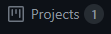
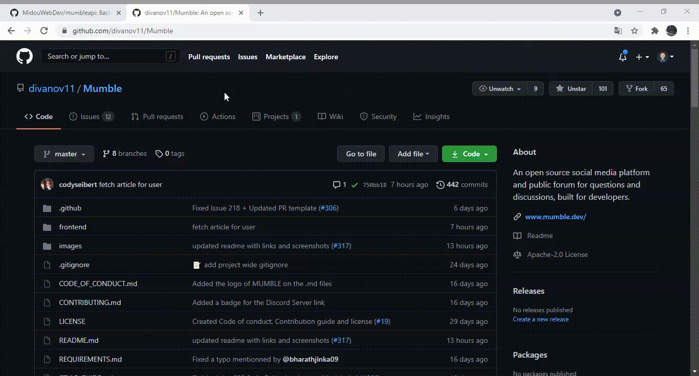

#

  
  <h1 align="center">
    Project Board in MUMBLE
  </h1>

  
  
  

### Project Board 

In our repository, there is a project board named Tasks - Mumble, it helps moderators to see how is the work going.
 

*Preview :*

#

### So please, while submitting a PR or Issue, make sure to :

 

