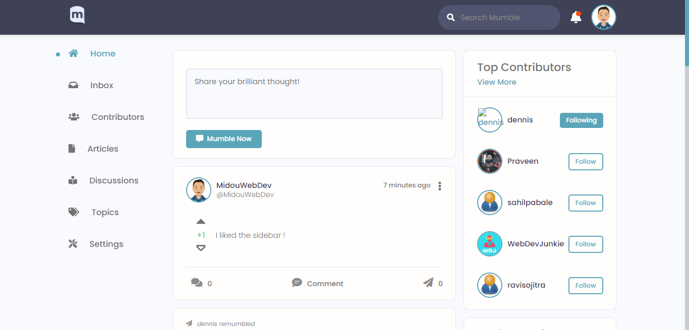
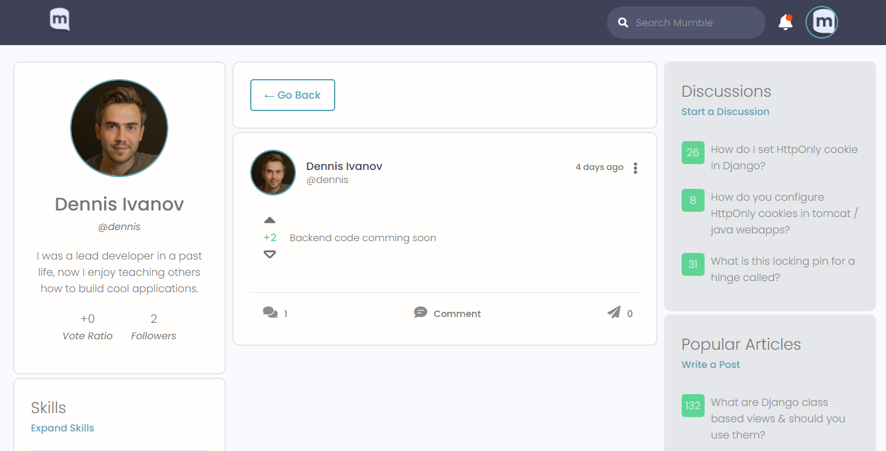
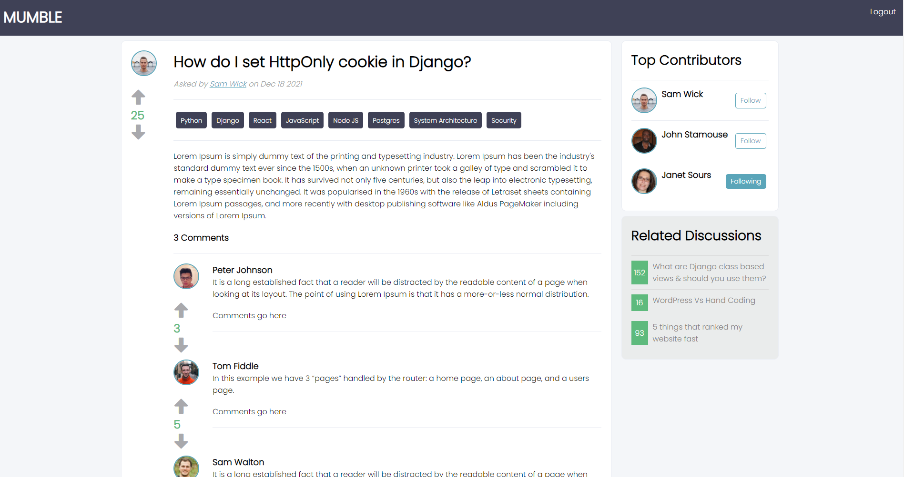
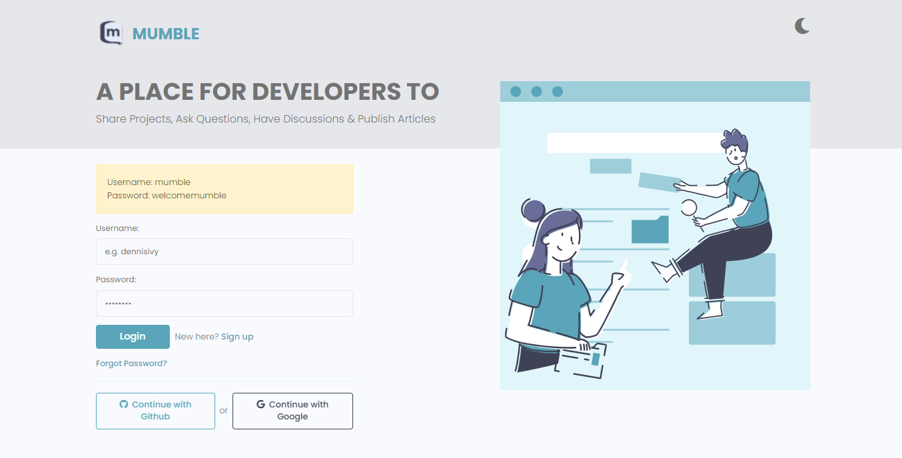
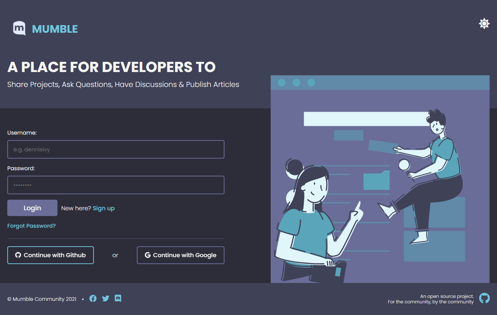

#

<p align="center">
  
  <h1 align="center">
    MUMBLE
  </h1>
<p align="center">An Open Source Social Media Platform and Public Forum for Questions and Discussions, built for Developers.</p>
</p>

<div align="center">
  
<a href="https://discord.gg/9Du4KUY3dE"></a>
<a href="https://www.mumble.dev"></a>
<a href="http://mumble-lp.s3-website-us-west-2.amazonaws.com/"></a>
<a href="https://open.vscode.dev/divanov11/mumbleapi.git"></a>

</div>

## Download & Setup Instructions :

Before downloading the project, check to make sure you meet the [project's requirements.](https://github.com/divanov11/Mumble/blob/master/REQUIREMENTS.md)

Clone the project. This will download the GitHub respository files onto your local machine.

```Shell
git clone https://github.com/divanov11/mumble
```

### Frontend Instructions (Create React App) :

---> Navigate to the `frontend/` directory

```Shell
cd Mumble && cd frontend
```

---> Install the project dependencies

```Shell
npm install
```

---> Start the development server on localhost:3000

```Shell
npm run start
```

---> Open your browser and navigate to either `http://localhost:3000 or http://127.0.0.1:3000`

## Want to Contribute?

Check out the [contributing guide](https://github.com/divanov11/Mumble/blob/master/CONTRIBUTING.md).
Also if you are looking for a complete style guides, please refer to [**Mumble Style Guide**](STYLE_GUIDE.md).
We highly recommend to go through the guideline before start contributing.

> **_⚠ Those who wants to contribute on the repo, from now, before pushing/committing your changes, please make sure you run command `npm run format` or `yarn format` or use Prettier plugin to automatically format your code. We want to maintain consistency that's why we want to enforce the formatting. It's required! _**

## Reviewers :

After submitting your PR, please tag reviewer(s) in your PR message. You can tag anyone below for the following.

<br/>

- **Markdown, Documentation changes :** 

     Request [@Mehdi - MidouWebDev](https://github.com/MidouWebDev)'s review !

#

- **Frontend, Design :**

     --> *Choose two reviewers :*

    [@Dennis Ivy](https://github.com/divanov11)

    [@Shahriar Parvez](https://github.com/Mr-spShuvo)

    [@Cody Seibert](https://github.com/codyseibert)

    [@Mehdi - MidouWebDev](https://github.com/MidouWebDev)
    

## 📸 Screenshots :

**User Feed** : <br/>

<table width="100%"> 
<tr>
<td width="50%">      
&nbsp; 
<br>
<p align="center">
  Light Mode
</p>

</td> 
<td width="50%">
<br>
<p align="center">
Dark Mode
</p>
  
</td>
</table>
<br/>

**User Profile Page** : <br/>

<table width="100%"> 
<tr>
<td width="50%">
&nbsp; 
<br>
<p align="center">
  Light Mode
</p>

</td>
</table> 
<!-- i will upload the Dark Mode screenshots soon !-->
<br/>

**Discussion/Question Page** : <br/>

<table width="100%"> 
<tr>
<td width="50%">
&nbsp; 
<br>
<p align="center">
  Light Mode
</p>

</td> 
<!-- i will upload the Dark Mode screenshots soon !-->
<br/>
</table>

**Login Page** : <br/>

<table width="100%"> 
<tr>
<td width="50%">
&nbsp; 
<br>
<p align="center">
  Light Mode
</p>

</td> 
<td width="50%">
<br>
<p align="center">
Dark Mode
</p>
  
</td>
</table>
<br/>

