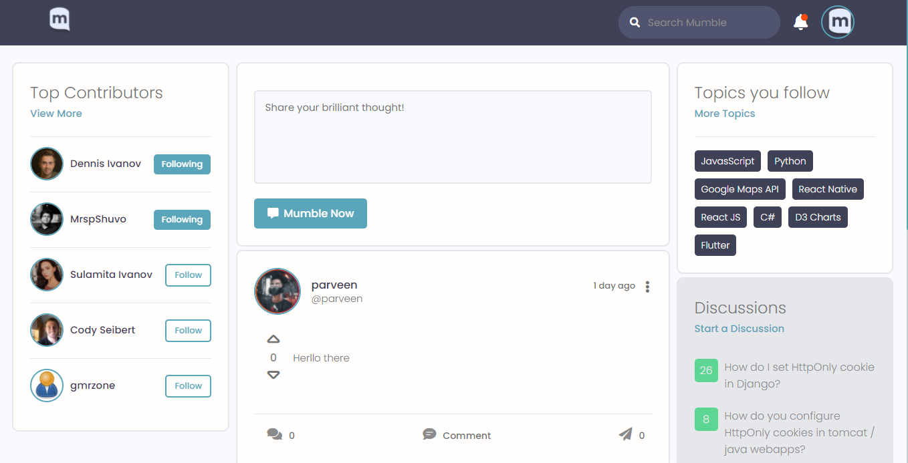
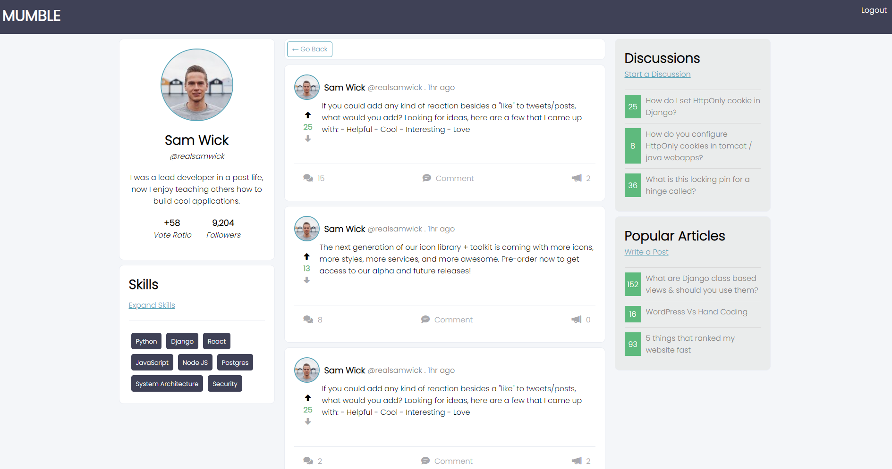
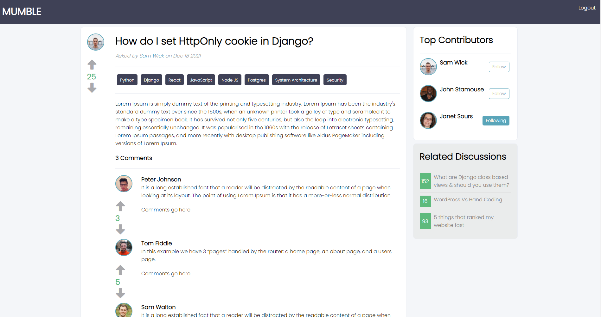
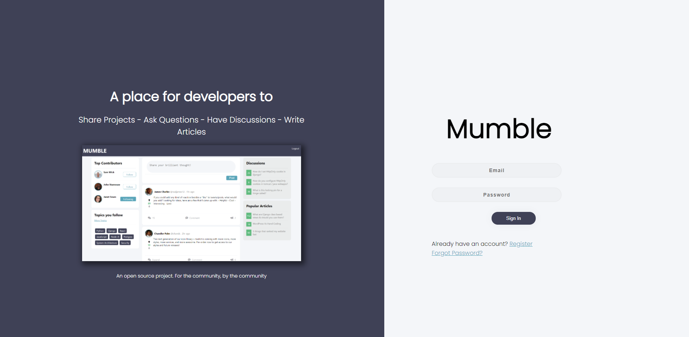

# MUMBLE

An Open Source Social Media Platform and Public Forum for Questions and Discussions, built for Developers.

## 🔗 Links
- **Live Demo: (https://mumble.vercel.app/)**
- **UI Kit (Docs/Preview) 👉 [Here](http://mumble-lp.s3-website-us-west-2.amazonaws.com/)**
- **Discord [Join here](https://discord.gg/TxgpyK8pzf)**

## Download & Setup Instructions

Clone the project. This will download the GitHub respository files onto your local machine.

```Shell
git clone https://github.com/divanov11/mumble
```

### Frontend Instructions (Create React App)

Navigate to the `frontend/` directory

```Shell
cd Mumble && cd frontend
```

Install the project dependencies

```Shell
npm install
```

Start the development server on localhost:3000

```Shell
npm start
```

## Want to Contribute?

Check out the [contributing guide](https://github.com/divanov11/Mumble/blob/master/CONTRIBUTING.md).

> **_⚠ Those who wants to contribute on the repo, from now, before pushing/committing your changes, please make sure you run command `npm run format` or `yarn format` or use Prettier plugin to automatically format your code. We want to maintain consistency that's why we want to enforce the formatting. It's required!_**

## 📸 Screenshots

**User Feed** : <br/><br/>



**User Profile Page** : <br/><br/>


**Discussion/Question Page** : <br/><br/>


**Login Page** : <br/><br/>

