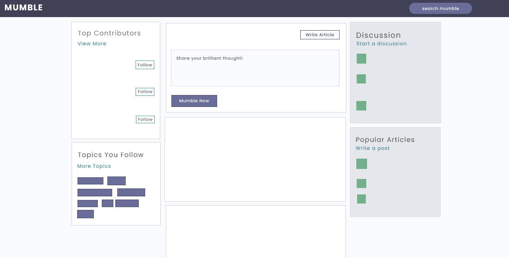
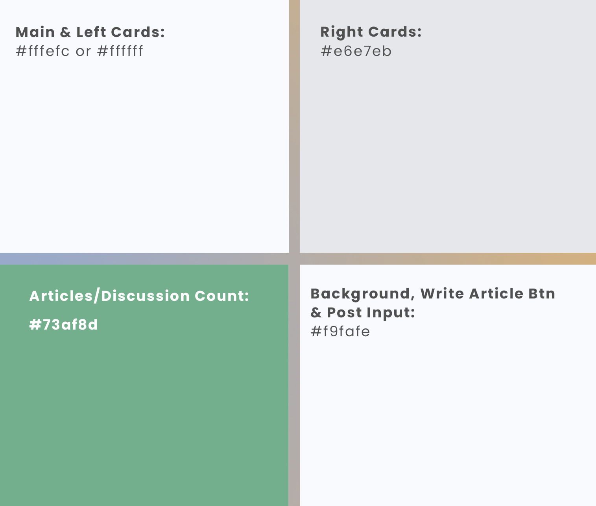
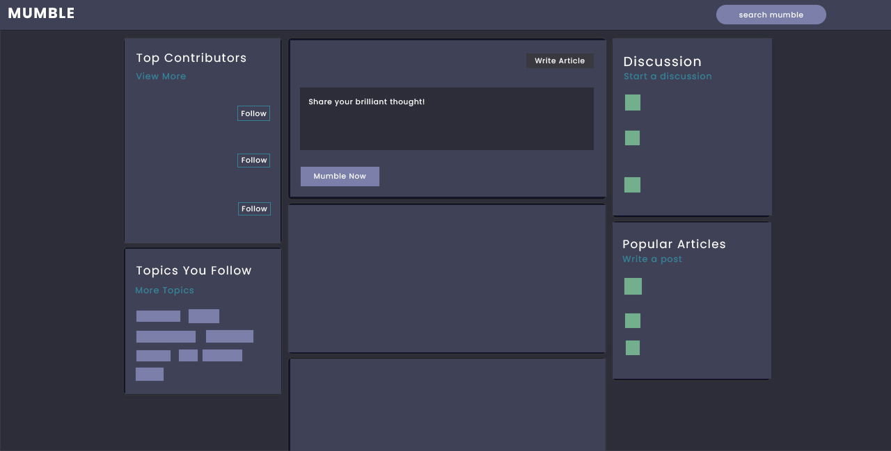
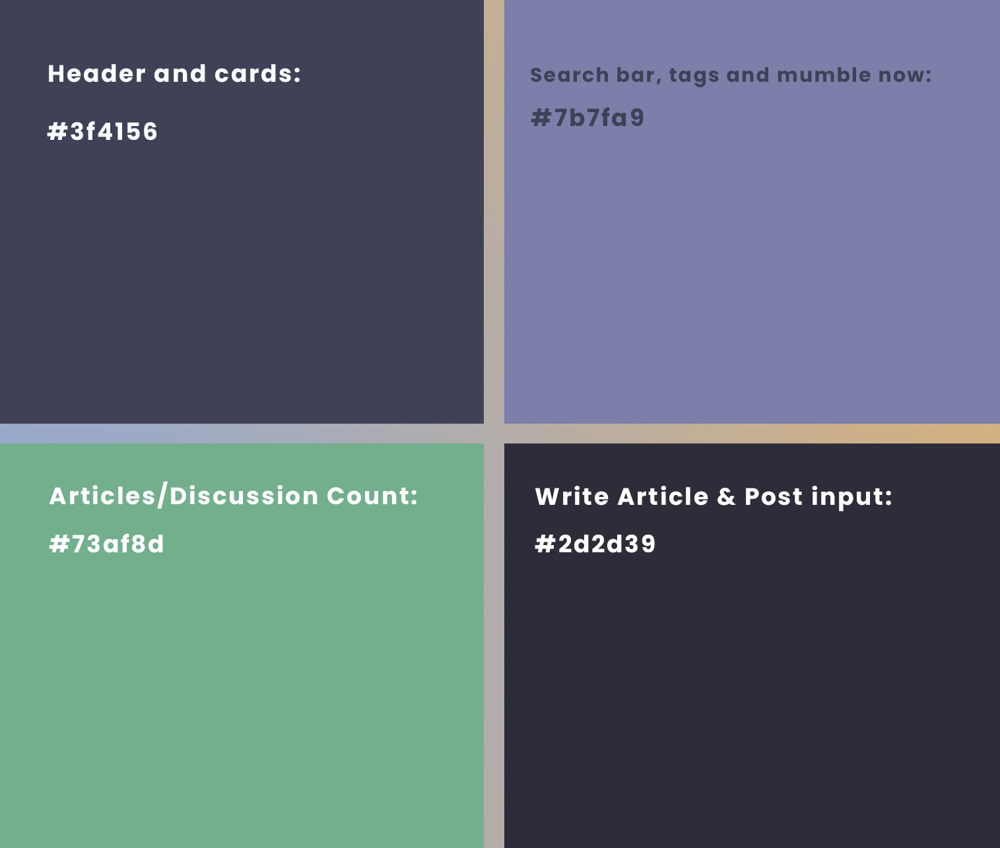
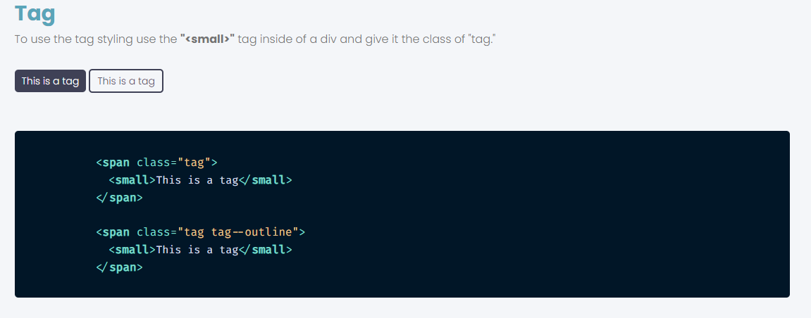
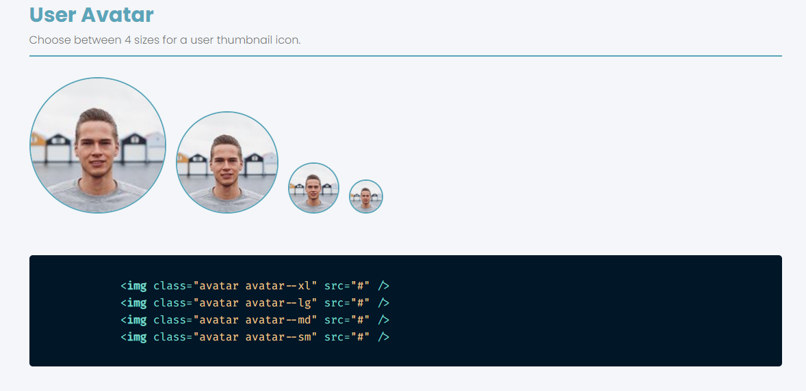
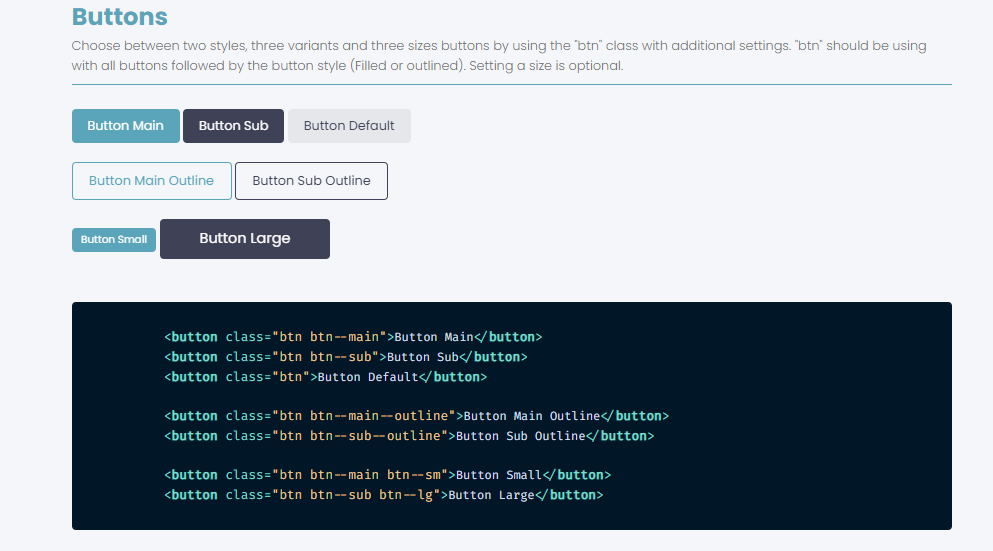

#

<p align="center">
  
  <h1 align="center"> 🎨 | Mumble Style Guide </h1>
</p>

The main goal of this style guide is providing the contributors a set of instructions about how he should approach writing codes and what are the excepted when a PR has been placed. This guide will walk you through the codebase, conventions, and principles we are currently following. We, the mumble community, do not want to enforce with all kinds of code conventions to anyone, but as the project gets larger, and there are many contributors are joining each days, it'll get quiet messy very quickly unless there is a set of instructions to follow for maintaining the consistency and improving the code readability. We also believe that, having some kinds of conventions to follow is much better than having no conventions at all; without some kinds conventions 100 different people can write code 100 different ways, which will be results in messy codebase. That's why, we are introducing you to the **Mumble Style Guide**. We highly recommends you to go through the guideline time to time. We will keep this file up to date with any changes in projects.

> ⚠ _THIS DOCS IS CURRENTLY WORK-IN-PROGRESS. LOOKING FOR CONTRIBUTORS TO COMPLETE THIS GUIDELINE, ANY QUESTIONS AND SUGGESTIONS JOIN [OUR DISCORD SERVER](https://discord.gg/TxgpyK8pzf)._

<h2 align="center">Table of Contents</h2>

- 🗂 Directory Structures

- 🎭 Mumble CSS Style Guide

      - 📦 Modularity
      - 🎹 Pattern and Naming
      - 🎨 Colors
      - ✍ Fonts
      - 🧰 UI Kits

- ⚛ Mumble React/JSX Style Guide

      - 📖 Basic Rules
      - ⛑ Function Components vs Class Components
      - 🎯 Importing and Exporting Modules
      - 🎏 Declaration
      - 🔺🔻 Ordering
      - ➰ Naming
      - ⭕ Parentheses, Spacing and Quotes
      - 🔯 Props and PropTypes
      - 🪁 JSX
<br/>
<h2 align="center">🗂 Directory Structures</h2>

|Folder|Description|
|:--:|:--:|
|**.github**|**GitHub related stuff**|
|**frontend**|**The frontend development folder**|
|frontend > **cypress**|**The Cypress folder**|
|frontend > **public**|**contains the HTML file, the icons for all devices**|
|frontend > **src**|**The development folder !**|
|**images**|**contain images used in ".md" files**|

#


<h2 align="center">🎭 Mumble CSS Style Guide</h2>


#### 📦 Modularity :

    Modular CSS is:

    - A guideline-based approach for breaking down pages into generic reusable CSS code.
    - Based on classes and consistent naming conventions.
    - Easy to read and maintain.

That's why in Mumble, we use **BEM** : *one of the CSS Modules* !

    Discover BEM in the section below 👇
#


#### 🎹 Pattern and Naming :
The Mumble frontend uses the Block, Element, Modifier methodology (commonly referred to as BEM) which is a popular naming convention for classes in HTML and CSS. It helps developers better understand the relationship between the HTML and CSS in a given project. An example of Bem is shown below:
```css
/* Block component: Standalone entity that is meaningful on its own */

.card {}

/* Element: An entity that depends upon the block */ 

.card__image {}
.card__item {}
.card__button {}

/* Modifier that changes the style of the block or block element*/

.card__item--active {} 
.card__button--active {} 
```
The markup might then look like this:
```html
<div class="card">
    <span class="card__image"></span>
    <div class="card__content">
        <ul class="card__list">
            <li class="card__item card__item--active">Item 1</li>
            <li class="card__item">Item 2</li>
        </ul>
        <p class="card__description">Lorem Ipsum excet tera ..</p>
        <a class="card__button" href="/">Click Here</a>
    </div>
</div>

```

#### 🎨 Colors :
**---> The website has two themes :**

      - Light Mode
      - Dark Mode

**---> For the Light Mode :**

*-> Preview :* <br/>

<p align="center">
<br/>
</p>

*-> Colors for the light mode :*

  |Types |Informations|
  |:--:|:--:|
  |**main**|**#5aa5b9**|
  |**main-light**|**#e1f6fb**|
  |**sub**|**#3f4156**|
  |**sub-light**|**#51546e**|
  |**text**|**#737373**|
  |**gray**|**#8b8b8b**|
  |**light**|**#e5e7eb**|
  |**light-gray**|**##76767**6|
  |**bg**|**#f8fafd**|
  |**white**|**#fffefd**|
  |**white-light**|**#fafafa**|
  |**success-msg**|**#5dd693**|
  |**error-msg**|**#fc4b0b**|
  
*-> Light Mode Pallette:*
<p align="center">

</p>

**---> For the Dark Mode :**

*-> Preview :* <br/>

<p align="center">
<br/>
</p>

*-> Colors for the Dark Mode :*

  |Types |Informations|
  |:-:|:-:|
  |**main**|**#71c6dd**|
  |**sub-light**|**#3f4156**|
  |**sub**|**#696d97**|
  |**main-light**|**#3f4156**|
  |**text**|**#f5f5f5**|
  |**gray**|**#c5c5c5**|
  |**light**|**#313131**|
  |**light-gray**|**#bbb**|
  |**bg**|**#2d2d39**|
  |**white**|**#1f1f1f**|
  |**white-light**|**#1f1f1f**|

*-> Dark Mode Pallette :*
<p align="center">

</p>

#

#### ✍️ Fonts :

  |Types|Information|
  |:-:|:-:|
 |**font-base**|**- Poppins<br/>- Arial<br/> - Helvetica<br/> - Segoe UI<br/> - Roboto<br/> - Ubuntu<br/> - sans-serif<br/>**|
  |**font-monospace**|**-Fira Code<br/> -Courier New<br/>-Courier<br/>-monospace**|
  |**font-regular**|**300**|
  |**font-medium**|**500**|
  |**font-bold**| **700**|

#

#### 🧰 UI Kits : 

<br/>
---> Here is a preview ! 👇
<br /><br />
<p align="center">
  
  
  
</p>
<br />

**---> Visit the Mumble UI Kit 👉** <a href="http://mumble-lp.s3-website-us-west-2.amazonaws.com/"></a>

#

<h2 align="center">⚛ Mumble React/JSX Style Guide</h2>

#### 📖 Basic Rules :

#

#### ⛑ Function Components vs Class Components :

#

#### 🎯 Importing and Exporting Modules :

#

#### 🎏 Declaration :

#

#### 🔺🔻 Ordering :

#

#### ➰ Naming :

#

#### ⭕ Parentheses, Spacing and Quotes :

#

#### 🔯 Props and PropTypes :

#

#### 🪁 JSX :

#
